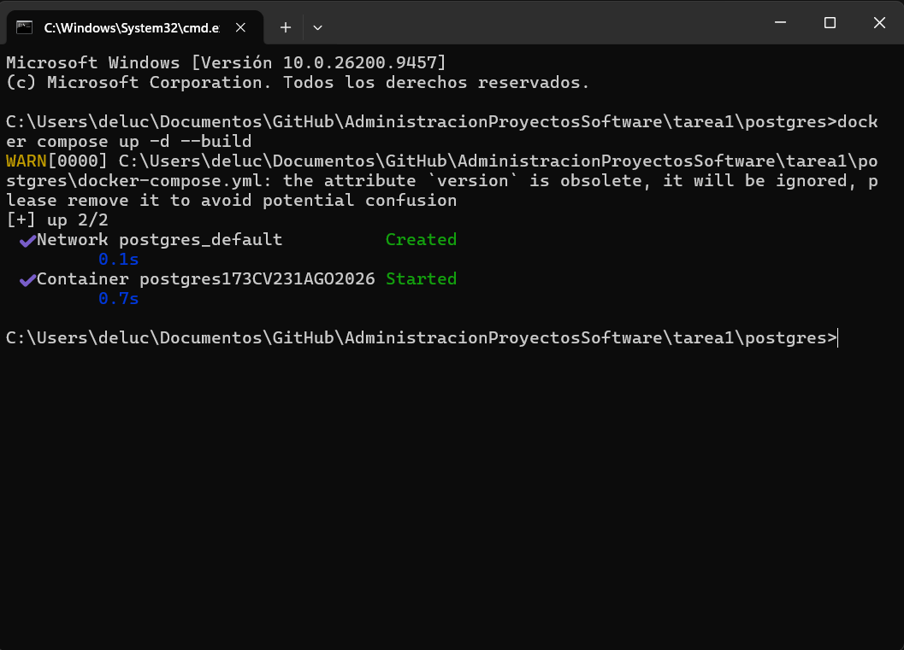
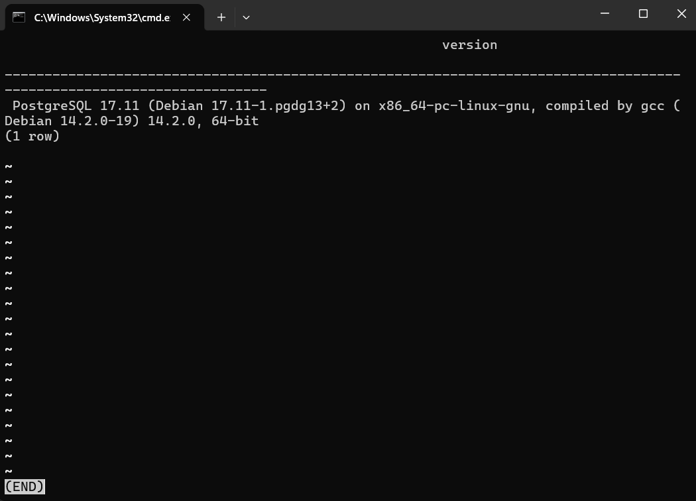
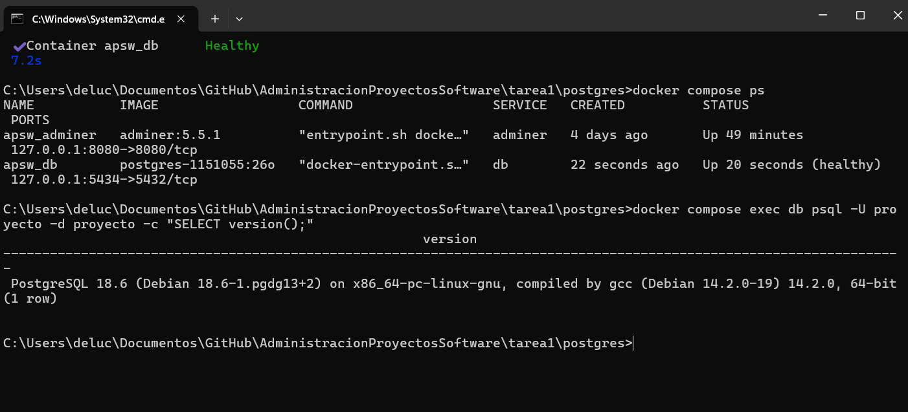
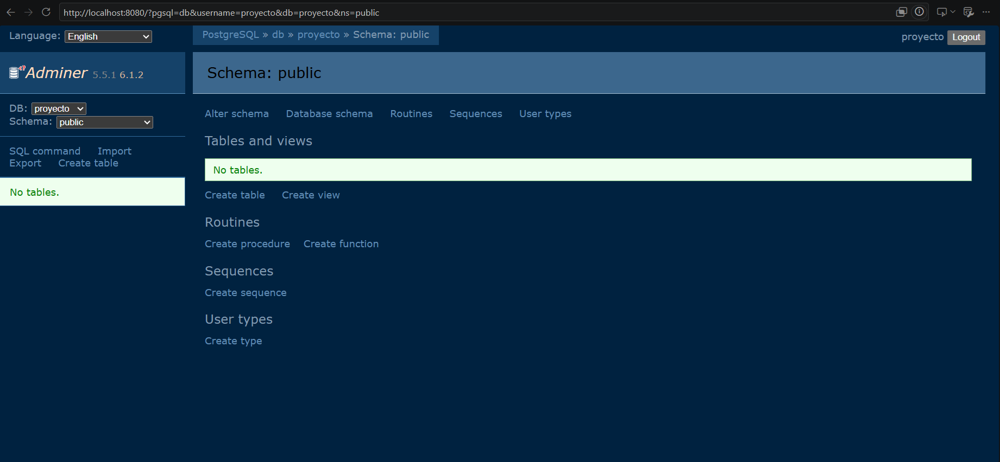
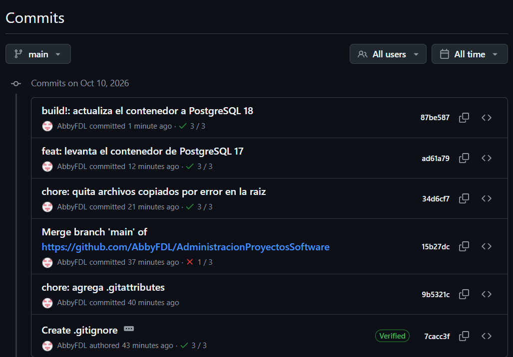
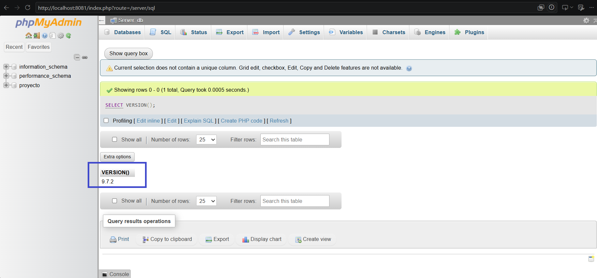
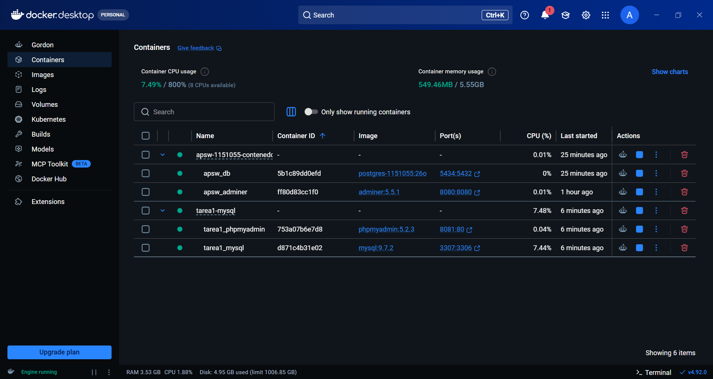
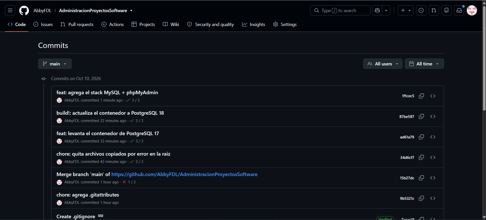

# Tarea 1 · Introducción a la administración de proyectos y entorno de trabajo

| | |
|---|---|
| **UEA y clave** | Administración de Proyectos de Software (1151055) |
| **Trimestre** | 26-O, otoño 2026 |
| **Licenciatura** | Ingeniería en Computación |
| **Nombre** | Abril Flores De Lucio |
| **Matrícula** | 2223001369 |
| **Profesor** | M. en C. Gabriel Hurtado Avilés |
| **Fecha** | 10 de octubre de 2026 |

---

## Ejercicio 2 · Investigación

### 1. ¿Qué es un proyecto de software?

<!-- Con tus palabras: qué es un proyecto y en qué se distingue de una operación continua.
     Diferencia entre proyecto, producto y proceso.
     Las cuatro restricciones: alcance, tiempo, costo y calidad. -->
Un proyecto de software es una serie de actividades diseñadas y planificadas para la creacion de un producto de software que cumple las necesidades de un cliente; enfocadas en la creación, diseño, despliegue y mantenimiento del producto.

A diferencia de una operación continua el proyecto de software tiene un fin claro, mientras que la operación continua son actividades que pueden continuar a pesar de que el producto sea entregado a un cliente. Se enfoca en mantener, mejorar y actualizar un sistema todos los dias. 

La operación continua es parte de un proyecto de software; a pesar de que se termine y entregue el proyecto, la operación continua debera seguir siendo parte del sistema.

Como diferencias entre proyecto, producto y proceso son que estos 3 elementos son pasos o partes de una misma secuencia.
El proyecto, como ya habia mensionado, son las actividades a realizar, es el qué se va a realizar para el sistema, el proceso es el cómo se va a realizar el mismo, y el producto es lo que se obtiene una vez que se han seguido todos los pasos predecesores, y el entregable que debe cumplir con las espectativas del cliente.

Alguans de las áreas generales de conocimiento mas importantes a saber planteadas por el Project Management Institute (PMI) son:
 ·Alcance: se define lo que se va a relalizar y lo que no, el producto a entregar, los proyectos y la reparticion del trabajo en partes mas pequeñas y ordenadas.
 ·Tiempo: el momento en el que se deberá realizar cada tarea, ordenando las actividades y creando un cronograma.
 ·Costo: la definición del presupuesto del que va a requerir la ejecución del proyecto
 ·Calidad: qué tan bien debe quedar el producto. Se planea y se controla aplicando estándares de calidad al entregable final.
 [1]

### 2. ¿Cómo se administra?

<!-- Qué es la Guía del PMBOK y qué es Scrum.
     Diferencia entre modelo predictivo, iterativo y ágil (una tabla pequeña ayuda).
     Cuál elegirías para un proyecto como el del curso y por qué.-->

Guía del PMBOK (Project Management Body of Knowledge): es un estándar de buenas prácticas en gestión de proyectos desarrollado por el Project Management Institute (PMI). Se basa en un enfoque estructurado y predictivo compuesto por 5 grupos de procesos (Inicio, Planificación, Ejecución, Monitoreo/Control y Cierre) y 10 áreas de conocimiento (alcance, tiempo, costo, calidad, riesgos, etc.) [2].

Scrum: es una metodología ágil para proyectos dnamicos o de software; que ayuda a segmentar un proyecto en ciclos cortos y repetitivos llamados sprints (que duran de 2 a 4 semanad) y se apoya de roles definidos(Product Owner, ScrumMaster, Team), eventos (Daily Scrum, Sprint Planning, Review) y artefactos (Product Backlog, Sprint Backlog) para incrementos de valor frencuente [2].

**Diferencia entre modelo predictivo, iterativo y ágil**

| Criterio | Modelo predictivo (p. ej., cascada) | Modelo iterativo | Modelo ágil (p. ej., Scrum) |
|---|---|---|---|
| **Enfoque principal** | Planificación detallada al inicio y control lineal de fases. | Refinamiento progresivo del producto mediante repeticiones de desarrollo. | Entrega rápida de valor funcional, con alta adaptabilidad al cambio. |
| **Definición del alcance** | Fijo y detallado desde el inicio. | Se refina en cada iteración. | Dinámico; los requisitos evolucionan constantemente. |
| **Entrega del producto** | Una sola entrega al final del ciclo de vida. | Entregas progresivas, una versión por ciclo. | Entregas frecuentes e incrementales al final de cada sprint. |
| **Participación del cliente** | Alta al inicio (definición) y al final (aceptación). | Periódica, en las revisiones de cada iteración. | Continua durante todo el desarrollo. |

[2]

Para ka elaboración de nuestro futuro proyecto en la materia lo mas conveniente seria utilizar un enfoque ágil como el Scrum, que nos permitira realizar las tareas poco a poco con pruebas en determinado tiempo, que sera flexible para ajustar los requisitos segun la retroalimentacion del profesor y que ayudara a realizar un mejor trabajo colaborativo.

### 3. ¿Con qué herramientas?

<!-- Para qué sirven: control de versiones, tableros de trabajo, contenedores, integración continua.
     Docker frente a una máquina virtual.
     Dockerfile frente a compose.yaml.
     Qué es un volumen.
     Qué hacen: up -d, exec, stop, down, ps, logs (una tabla de comando | para qué sirve).-->
**Para qué sirve cada tipo de herramienta**

Control de versiones: nos ayudará a guardar el historial de cambios del proyecto: quién cambio qué, cuándo y por qué. Permitirá volver a versiones anteriores y trabajar en equipo sin presiones [3].

Tableros de trabajo: organizan las tareas del equipo en columnas para ver el avance(por hacer, en proceso, terminado).

Contenedores: empaquetan una aplicación con todo lo que necesita para que funcione igual en cualquier computadora [4].

Integración continua: compila y prueba el código automáticamente cada vez que alguien sube cambios, para detectar errores pronto.

Git es un sistema de control de versiones distribuido: cada persona tiene una copia completa del historial en su computadora [3].

**Docker frente a una máquina virtual**

Una máquina virtual simula una computadora completa, con su propio sistema operativo, por eso pesa varios GB y tarda en arrancar. Un contenedor comparte el núcleo del sistema operativo de la computadora y solo trae la aplicación y sus dependencias, así que es más ligero y arranca en segundos. En esta tarea levanté tres bases de datos en contenedores sin instalar ninguna en Windows.
[4]

**Dockerfile frente a compose.yaml**

- El **Dockerfile** es la receta para construir **una imagen**: de qué imagen parte (`FROM postgres:18.6`), qué se le instala y cómo se configura.
- El **compose.yaml** describe **cómo se levantan uno o varios contenedores juntos**: qué imágenes usan, puertos, variables, volúmenes y el orden en que arrancan [5].

**¿Qué es un volumen?**

Es un espacio donde Docker guarda datos fuera del contenedor. Si el contenedor se borra, los datos del volumen se conservan. En la tarea, `datos_db` y `datos_mysql` guardan las bases de datos 
[6].

**Comandos de Docker Compose**

| Comando | Para qué sirve |
|---|---|
| `docker compose up -d` | Crea y enciende los contenedores en segundo plano (`-d`), sin bloquear la terminal. |
| `docker compose exec` | Ejecuta un comando dentro de un contenedor que ya está corriendo, por ejemplo `psql`. |
| `docker compose stop` | Apaga los contenedores sin borrarlos; se pueden volver a encender. |
| `docker compose down` | Apaga **y elimina** los contenedores y la red. Los volúmenes se conservan, salvo que se use `-v`. |
| `docker compose ps` | Muestra qué contenedores están corriendo y su estado, por ejemplo `(healthy)`. |
| `docker compose logs` | Muestra los mensajes de los contenedores; sirve para ver errores. |

[5]

### 4. ¿Bajo qué licencia se distribuye el software?

#### a) Los dos grandes tipos

Las licencias **permisivas** dejan hacer casi cualquier cosa con el código, incluso usarlo dentro de software cerrado, siempre que se reconozca al autor. Las **copyleft** también dan esas libertades, pero exigen que, si se distribuye una versión modificada o un programa derivado, se comparta con la misma licencia y con su código fuente [7], [8].

| Licencia | Tipo | Qué permite | Qué exige |
|---|---|---|---|
| MIT | Permisiva | Usar, copiar, modificar, distribuir y vender el software, incluso dentro de un programa cerrado. | Conservar el aviso de copyright y el texto de la licencia. No da garantía. |
| BSD | Permisiva | Lo mismo que MIT: uso, modificación y distribución libre, también en software cerrado. | Conservar el aviso de copyright y la licencia. La versión de 3 cláusulas prohíbe usar el nombre de los autores para promocionar productos derivados. |
| Apache 2.0 | Permisiva | Lo mismo que MIT, y además da permiso explícito sobre las **patentes** del código. | Incluir la licencia, conservar los avisos (incluido el archivo `NOTICE`) e indicar qué archivos se modificaron. |
| GPL | Copyleft | Usar, estudiar, modificar, distribuir y vender el software. | Si se distribuye el programa o una versión modificada, debe entregarse con el **código fuente** y bajo la **misma licencia GPL**. |
| LGPL | Copyleft débil | Usar la biblioteca desde un programa cerrado (enlazarla) sin que todo el programa tenga que ser LGPL. | Los cambios **a la biblioteca misma** deben compartirse bajo LGPL, y el usuario debe poder reemplazarla por otra versión. |
| AGPL | Copyleft fuerte | Lo mismo que la GPL. | Lo mismo que la GPL, y además, si el programa se ofrece como **servicio por internet**, hay que dar el código fuente a quienes lo usan en línea. |

[7]

#### b) Mi elección

<!-- Por qué tu repositorio usa MIT, qué ventajas tiene y qué cambiaría con GPL. -->
Además de que mi repositorio es MIT por sugerencia del profesor, me parece que es mas conveniente para quienes lo usan, ya que la modificación de códigos es de lo mas común en este sector, al realizar esos cambios con ayuda de la licencia MIT podemos privatizar nuestro propio código sin necesidad de autroizaciones o restricciones extra, a diferncia de la GPL que es de tipo Copyleft, que en caso de que desea mejorar o enfocar mi codigo en un entorno diferente no podría hacerla propiamente mía, ya que en un principio fue destinada a uso libre.

#### c) Un caso real: MySQL y MariaDB

MySQL fue creada por la empresa sueca MySQL AB y se distribuía con licencia GPL. En 2008 la compró Sun Microsystems, y en 2010 Oracle adquirió Sun, con lo que MySQL quedó en manos de una empresa que vende su propia base de datos comercial. Esto generó desconfianza en la comunidad sobre el futuro de MySQL como proyecto libre [9].

En 2009, Michael "Monty" Widenius, cofundador de MySQL, tomó el código y creó MariaDB, un *fork* compatible con MySQL y mantenido por la comunidad [9]. Con el tiempo, proyectos como Wikipedia y distribuciones de Linux como Fedora y Red Hat Enterprise Linux adoptaron MariaDB en lugar de MySQL.

**¿Por qué la licencia lo permitió?** 

Porque MySQL era GPL, y la GPL da a cualquiera el derecho de copiar, modificar y redistribuir el código sin pedir permiso al dueño. Oracle podía controlar la marca "MySQL", pero no impedir que alguien usara el código. Además, la GPL obligó a que MariaDB también fuera GPL, así que la alternativa no puede cerrarse [10].

---

## Ejercicio 3 · De PostgreSQL 17 a 18

### Diferencias entre los dos contenedores

### Diferencias entre los dos contenedores

| Aspecto | Qué decía (17) | Qué dice (18) | Por qué cambió |
|---|---|---|---|
| Nombre del archivo | `docker-compose.yml` | `compose.yaml` | Es el nombre que Docker recomienda ahora [5]. |
| Primera línea | `version: '3.8'` | No hay | Ya es obsoleta; Compose la ignora [5]. |
| Imagen | `postgres:17` | `FROM postgres:18.6` | Versión exacta, construida desde el Dockerfile. |
| Datos | `./data:/var/lib/postgresql/data` | `datos_db:/var/lib/postgresql` | Volumen de Docker; la 18 cambió la ruta de los datos [6]. |
| Contraseña | escrita: `postgres` | `${POSTGRES_PASSWORD:-...}` | Ya no queda escrita en el repositorio. |
| Puerto | `"5432:5432"` | `"127.0.0.1:5434:5432"` | Solo acceso local y sin chocar con el 5432. |
| ¿Sabe si está lista? | No | `healthcheck` | Avisa cuando la base ya acepta conexiones. |
| Interfaz web | No | Adminer | Ver las tablas desde el navegador. |
| Carpeta del proyecto dentro | No, sólo `data/` | `./:/trabajo` | Para ejecutar los scripts `.sql` del proyecto. |

### ¿Se usaba el Dockerfile viejo?

No. El `docker-compose.yml` viejo no tenía la instrucción `build:`, solo `image: postgres:17`, así que Compose descargaba la imagen oficial directamente y el Dockerfile se ignoraba: cualquier cambio en él no tenía efecto. En cambio, el `compose.yaml` nuevo sí tiene `build: .`, que le indica a Compose construir la imagen con el Dockerfile de la carpeta [5]

### Versionado semántico

El versionado semántico usa el formato **MAYOR.MENOR.PARCHE**: el PARCHE sube cuando se corrigen errores, el MENOR cuando se agregan funciones compatibles con lo anterior, y el MAYOR cuando hay cambios que **rompen la compatibilidad** [11].

PostgreSQL usa una variante de dos números: en `18.6`, el 18 es la versión mayor y el 6 la menor, que solo trae correcciones [12]. Pasar de la 17 a la 18 es un cambio mayor porque **los datos guardados por la 17 no se pueden abrir directamente con la 18**: hay que migrarlos. Además cambió la ruta de los datos dentro del contenedor. Por eso, en la Fase B tuve que borrar la carpeta `data` y empezar con un volumen nuevo, y por eso el commit lleva `!` (`build!:`), que indica un cambio que rompe la compatibilidad.

---

## Ejercicio 4 · MySQL + phpMyAdmin

### PostgreSQL + Adminer frente a MySQL + phpMyAdmin

| Concepto | PostgreSQL + Adminer | MySQL + phpMyAdmin |
|---|---|---|
| Imagen de la base | `postgres:18.6` | `mysql:9.7.2` |
| Variables de entorno | `POSTGRES_*` | `MYSQL_*` |
| Puerto interno | 5432 | 3306 |
| Carpeta de datos | `/var/lib/postgresql` | `/var/lib/mysql` |
| Interfaz web | `adminer:5.5.1` | `phpmyadmin:5.2.3` |
| Puerto web en mi máquina | 8080 | 8081 |
| ¿Necesita Dockerfile? | Sí | No |

### LTS frente a innovation

MySQL publica dos tipos de versiones [13]:

| | LTS (*Long Term Support*) | Innovation |
|---|---|---|
| Qué es | Versión estable que se mantiene por **años** con correcciones de errores y seguridad. | Versión que trae las **funciones más nuevas** y sale cada pocos meses. |
| Soporte | Largo: años. | Corto: solo hasta que sale la siguiente innovation. |
| Para qué sirve | Proyectos que necesitan estabilidad, como producción o un curso. | Probar novedades antes de que lleguen a una LTS. |

**¿Por qué `mysql:9.7.2` y no `mysql:latest`?**

- `latest` no significa "estable", sino "la última que subieron". Hoy `mysql:latest` da la **26.7.0**, que es una versión innovation con soporte corto.
- `latest` **cambia con el tiempo**: si otra persona levanta el proyecto dentro de unos meses, le puede tocar otra versión distinta y el proyecto podría fallar.
- Con `9.7.2`, que es la **LTS**, todos usamos exactamente la misma versión, con soporte por años. Es la misma idea que fijar `postgres:18.6` en lugar de `postgres:18` o `latest`.

---

## Historial de confirmaciones

---

## Referencias

<!-- Sólo las que realmente citaste, en orden de aparición, formato APA 7. -->
[1] Toro López, F. J. (2013). *Administración de proyectos de informática*. Ecoe Ediciones.

[2] Riaño Nossa, N. D. (2021). *Estudio comparativo de metodologías tradicionales y ágiles aplicadas en la gestión de proyectos* [Tesis de especialización, Universidad Pontificia Bolivariana]. Repositorio Institucional UPB. https://repository.upb.edu.co/items/480ac4c8-5cd9-4732-aa9c-684c99ca1096

[3] Chacon, S., & Straub, B. (2014). *Pro Git* (2a ed.). Apress. https://git-scm.com/book/es/v2

[4] Docker Inc. (s.f.-a). *What is a container?* Docker Docs. https://docs.docker.com/get-started/docker-concepts/the-basics/what-is-a-container/

[5] Docker Inc. (s.f.-b). *Docker Compose*. Docker Docs. https://docs.docker.com/compose/

[6] Docker Inc. (s.f.-c). *Volumes*. Docker Docs. https://docs.docker.com/engine/storage/volumes/

[7] GitHub, Inc. (s.f.). *Choose an open source license*. https://choosealicense.com/licenses/

[8] Open Source Initiative. (s.f.). *OSI approved licenses*. https://opensource.org/licenses

[9] MariaDB Foundation. (s.f.). *About MariaDB Server*. https://mariadb.org/about/

[10] Free Software Foundation. (2007). *GNU General Public License, version 3*. https://www.gnu.org/licenses/gpl-3.0.html

[11] Preston-Werner, T. (s.f.). *Versionado semántico 2.0.0*. https://semver.org/lang/es/

[12] PostgreSQL Global Development Group. (s.f.). *Versioning policy*. https://www.postgresql.org/support/versioning/

[13] Oracle Corporation. (s.f.). *MySQL releases: Innovation and LTS*. MySQL Documentation. https://dev.mysql.com/doc/refman/8.4/en/mysql-releases.html

---

## Declaración de uso de inteligencia artificial

<!-- Obligatoria. Di con honestidad qué herramienta usaste y para qué. -->
Utilicé Claude (Anthropic) como apoyo para comprender los pasos de la guía, resolver errores relacionados con Git y Docker, y obtener la estructura de este README. Para los textos de investigación y las respuestas, consulté diversas fuentes, como Google Académico, Claude y Gemini, además de aportar palabras e ideas propias.
